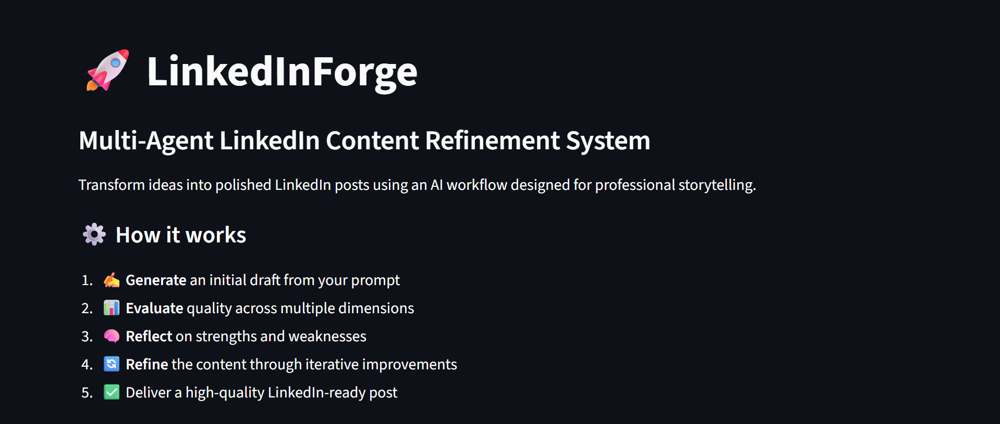
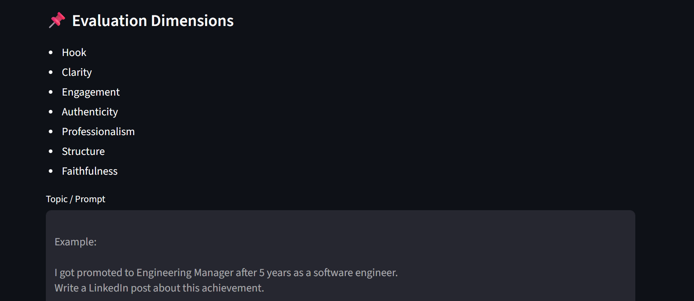
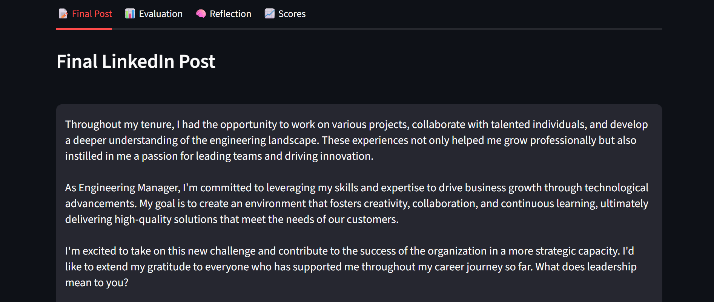
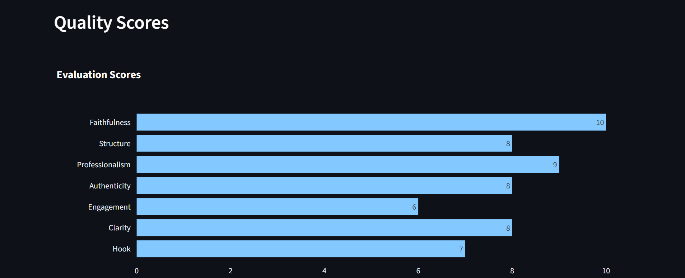

# 🚀 Intelligent LinkedIn Post Assistant

> Forge compelling LinkedIn content through multi-agent intelligence.

An AI-powered multi-agent system that transforms ideas into polished LinkedIn posts through iterative evaluation, reflection, and refinement.

Built with **LangGraph**, **LangChain**, **Ollama**, **FastAPI**, and **Streamlit**, this project explores how AI agents can collaborate to mimic the human writing process: drafting, critiquing, reflecting, and revising until high-quality output is achieved.

---


---

## 🎯 Why This Project?

Most AI writing tools generate content once and stop there.

Professional writing, however, is inherently iterative. People naturally draft, critique, reflect, and revise before publishing.

This project explores how **multi-agent systems** can replicate that process by combining generation, evaluation, reflection, and refinement into a feedback loop that continuously improves LinkedIn posts.

Rather than asking:

> "Can an LLM generate a LinkedIn post?"

This project asks:

> "Can multiple AI agents collaborate to improve professional writing through structured feedback and iterative refinement?"

---

## ✨ Features

* 📝 Generate LinkedIn posts from simple prompts
* 🤖 Multi-agent architecture powered by LangGraph
* 📊 Evaluate posts across multiple quality dimensions
* 🧠 Reflection-based improvement planning
* 🔄 Iterative refinement loops
* 📈 Interactive Streamlit dashboard
* ⚡ FastAPI service layer for production readiness
* 🦙 Runs entirely locally using Ollama
* 🧩 Structured outputs using Pydantic models

---

## 🎥 Demo









---

## 🏗️ System Architecture

### Workflow Diagram

```text
┌──────────────────────────┐
│          User            │
│   Enters Topic/Prompt    │
└────────────┬─────────────┘
             │
             ▼
┌──────────────────────────┐
│     Generator Agent      │
│──────────────────────────│
│ Creates initial draft    │
└────────────┬─────────────┘
             │
             ▼
┌──────────────────────────┐
│     Evaluator Agent      │
│──────────────────────────│
│ Scores the draft on:     │
│ • Hook                   │
│ • Clarity                │
│ • Engagement             │
│ • Authenticity           │
│ • Professionalism        │
│ • Structure              │
│ • Faithfulness           │
└────────────┬─────────────┘
             │
             ▼
┌──────────────────────────┐
│     Reflector Agent      │
│──────────────────────────│
│ Identifies:              │
│ • Priority issues        │
│ • Strengths to preserve  │
│ • Improvement operations │
└────────────┬─────────────┘
             │
             ▼
┌──────────────────────────┐
│      Refiner Agent       │
│──────────────────────────│
│ Rewrites the post using  │
│ the reflection plan      │
└────────────┬─────────────┘
             │
             ▼
      Needs Improvement?
             │
      ┌──────┴──────┐
      │             │
      ▼             ▼
     YES            NO
      │             │
      ▼             ▼
Back to Evaluator   Final Output
```

---

## 🔄 Workflow

The assistant follows a reflection-driven optimization loop inspired by emerging research in multi-agent systems.

### Step 1: Generate

The **Generator Agent** transforms the user's idea into an initial LinkedIn draft.

Example prompt:

> "I got promoted to Engineering Manager after 5 years as a software engineer. Write a LinkedIn post about this achievement."

---

### Step 2: Evaluate

The **Evaluator Agent** analyzes the draft and assigns scores for:

* Hook
* Clarity
* Engagement
* Authenticity
* Professionalism
* Structure
* Faithfulness

---

### Step 3: Reflect

The **Reflector Agent** identifies:

* Strengths to preserve
* Weaknesses to address
* Priority improvements
* Specific refinement operations

---

### Step 4: Refine

The **Refiner Agent** rewrites the post according to the reflection plan.

---

### Step 5: Iterate

If the post still requires improvement:

```text
Evaluate → Reflect → Refine
```

continues until the stopping criteria are met.

---

## 📊 Evaluation Dimensions

| Dimension       | Description                        |
| --------------- | ---------------------------------- |
| Hook            | Ability to capture attention       |
| Clarity         | Ease of understanding              |
| Engagement      | Likelihood of audience interaction |
| Authenticity    | Genuine professional voice         |
| Professionalism | Appropriateness for LinkedIn       |
| Structure       | Logical flow and readability       |
| Faithfulness    | Accuracy to the original intent    |

---

## 🖥️ Streamlit Interface

### Inputs

* Topic / Prompt textbox
* Generate & Optimize button

### Outputs

* 📝 Final LinkedIn Post
* 📊 Evaluation Report
* 🧠 Reflection Plan
* 📈 Quality Score Dashboard
* 🔁 Iteration Count

---

## 📈 Example Optimization Cycle

### Prompt

```text
I got promoted to Engineering Manager after 5 years as a software engineer.
```

↓

### Initial Draft

```text
I got promoted today. Hard work pays off.
```

↓

### Evaluation

```text
Hook: 7
Clarity: 8
Engagement: 6
```

↓

### Reflection

```text
• Improve opening sentence
• Increase storytelling
• Add actionable takeaway
```

↓

### Refined Draft

```text
Five years ago, I started my journey as a software engineer with more questions than answers.

Today, I'm excited to share that I've been promoted to Engineering Manager.

This milestone reminded me that growth rarely happens overnight. It is built through consistency, curiosity, and the willingness to learn from every challenge.

What has been the biggest lesson in your career journey so far?
```

↓

### Final Optimized LinkedIn Post

---

## 🧠 What I Learned

Through this project, I gained hands-on experience with:

* Designing stateful multi-agent workflows using LangGraph
* Building structured outputs with Pydantic
* Implementing reflection-driven optimization loops
* Developing FastAPI services for AI systems
* Creating interactive Streamlit interfaces
* Running local LLMs using Ollama
* Engineering prompts for collaborative AI agents
* Managing iterative agent coordination

---

## 📂 Project Structure

```text
LinkedIn/
│
├── src/
│   ├── agents/
│   │   ├── generator.py
│   │   ├── evaluator.py
│   │   ├── reflector.py
│   │   ├── refiner.py
│   │   └── workflow.py
│   │
│   ├── api/
│   │   ├── main.py
│   │   ├── routes.py
│   │   └── schema.py
|   |   └── service.py
│   │
│   ├── prompts/
│   │   ├── generator.py
│   │   ├── evaluator.py
│   │   ├── reflector.py
│   │   └── refiner.py
│   │
│   ├── schemas/
│   │   ├── evaluation.py
│   │   ├── reflection.py
│   │   └── operations.py
│   │
│   ├── utils/
│   │   ├── helpers.py
│   │   └── formatting.py
│   │
│   ├── UI/
│   │   └── streamlit.py
│   │
│   └── main.py
│
├── docs/
│   ├── screenshots/
│   └── architecture/
│
├── requirements.txt
├── README.md
├── .gitignore
└── LICENSE
```

---

## ⚙️ Tech Stack

### AI & Orchestration

* LangGraph
* LangChain
* Ollama

### Backend

* FastAPI
* Pydantic

### Frontend

* Streamlit
* Pandas
* Plotly

---

## 🚀 Installation

### Clone the Repository

```bash
git clone https://github.com/Kenaz-jose/intelligent-linkedin-post-assistant.git

cd intelligent-linkedin-post-assistant
```

---

### Create Virtual Environment

#### Windows

```bash
python -m venv linkedin
linkedin\Scripts\activate
```

#### macOS / Linux

```bash
python -m venv linkedin
source linkedin/bin/activate
```

---

### Install Dependencies

```bash
pip install -r requirements.txt
```

---

## 🦙 Ollama Setup

Install Ollama:

https://ollama.com/

Pull your preferred model:

```bash
ollama pull llama3
```

Start Ollama:

```bash
ollama serve
```

---

## ▶️ Running the Application

### Streamlit Dashboard

```bash
streamlit run src/UI/streamlit.py
```

Open:

```text
http://localhost:8501
```

---

### FastAPI Backend

```bash
uvicorn src.main:app --reload
```

Open API documentation:

```text
http://127.0.0.1:8000/docs
```

---

## 🎯 Future Improvements

* [ ] Post history and session management
* [ ] Export to PDF / Markdown
* [ ] Multiple writing styles
* [ ] A/B post generation
* [ ] Support for additional social platforms
* [ ] Cloud deployment
* [ ] Human-in-the-loop editing

---

## 🤝 Contributing

Contributions, suggestions, and feedback are welcome.

Feel free to open an issue or submit a pull request.

---

## 📜 License

This project is licensed under the MIT License.

---

## 👨‍💻 Author

Built by **Kenaz Jose**

If you found this project useful, consider giving it a ⭐ on GitHub.
